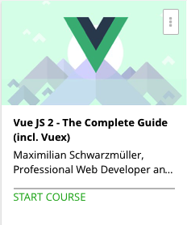

```
Roberto Nogueira  
BSd EE, MSd CE
Solution Integrator Experienced - Certified by Ericsson
```
# Vue.js 2 The Complete Guide



**About This Course**

Learn everything you need to about Vue.js.

## Topics
```
Section: 1
0 / 7
Getting Started
[x] 1. Course Introduction 3:08
[x] 2. Let's Create our First VueJS Application 4:45
[x] 3. Extending the VueJS Application 4:12
[x] 4. Course Structure 3:44
[x] 5. Take Advantage of all Course Resources! 1:55
[x] 6. Setup VueJS Locally 2:02
[x] 7. Module Resources & Useful Links 0:00

Section: 2
0 / 37
Using VueJS to Interact with the DOM
[ ] 8. Module Introduction 0:45
[ ] 9. Understanding VueJS Templates 2:34
[ ] 10. How the VueJS Template Syntax and Instance Work Together 2:42
[ ] 11. Accessing Data in the Vue Instance 1:49
[ ] 12. Binding to Attributes 2:42
[ ] 13. Understanding and Using Directives 1:27
[ ] 14. Disable Re-Rendering with v-once 1:41
[ ] 15. How to Output Raw HTML 2:43
[ ] 16. Time to Practice - Outputting Data to Templates (Problem) 1:59
[ ] 17. Time to Practice - Outputting Data to Templates (Solution) 6:12
[ ] 18. Time to Practice - Outputting Data to Templates (Code) 0:00
[ ] 19. Listening to Events 1:50
[ ] 20. Getting Event Data from the Event Object 2:36
[ ] 21. Passing your own Arguments with Events 1:53
[ ] 22. Modifying an Event - with Event Modifiers 3:23
[ ] 23. Listening to Keyboard Events 2:03
[ ] 24. Time to Practice - Events (Problem) 1:42
[ ] 25. Time to Practice - Events (Solution) 4:54
[ ] 26. Time to Practice - Events (Code) 0:00
[ ] 27. Writing JavaScript Code in the Templates 3:19
[ ] 28. Using Two-Way-Binding 1:49
[ ] 29. Reacting to Changes with Computed Properties 9:32
[ ] 30. An Alternative to Computed Properties: Watching for Changes 3:53
[ ] 31. Saving Time with Shorthands 1:26
[ ] 32. Time to Practice - Reactive Properties (Problem) 2:28
[ ] 33. Time to Practice - Reactive Properties (Solution) 5:47
[ ] 34. Time to Practice - Reactive Properties (Code) 0:00
[ ] 35. Dynamic Styling with CSS Classes - Basics 4:22
[ ] 36. Dynamic Styling with CSS Classes - Using Objects 1:35
[ ] 37. Dynamic Styling with CSS Classes - Using Names 3:27
[ ] 38. Setting Styles Dynamically (without CSS Classes) 3:15
[ ] 39. Styling Elements with the Array Syntax 1:14
[ ] 40. Time to Practice - Styling (Problem) 3:49
[ ] 41. Time to Practice - Styling (Solution) 18:17
[ ] 42. Time to Practice - Styling (Code) 0:00
[ ] 43. Module Wrap Up 0:44
[ ] 44. Module Resources & Useful Links 0:00

Section: 3
0 / 15
Using Conditionals and Rendering Lists
[ ] 45. Module Introduction 0:48
[ ] 46. Conditional Rendering with v-if 3:37
[ ] 47. Using an Alternative v-if Syntax 1:36
[ ] 48. Don't Detach it with v-show 1:43
[ ] 49. Rendering Lists with v-for 2:25
[ ] 50. Getting the Current Index 1:51
[ ] 51. Using an Alternative v-for Syntax 1:10
[ ] 52. Looping through Objects 4:44
[ ] 53. Looping through a List of Numbers 0:57
[ ] 54. Keeping Track of Elements when using v-for 4:08
[ ] 55. Time to Practice - Conditionals and Lists (Problem) 1:40
[ ] 56. Time to Practice - Conditionals and Lists (Solution) 9:38
[ ] 57. Time to Practice - Conditionals and Lists (Code) 0:00
[ ] 58. Module Wrap Up 0:51
[ ] 59. Module Resources & Useful Links 0:00

Section: 4
0 / 16
First Course Project - The Monster Slayer
[ ] 60. Introduction & Challenge 2:54
[ ] 61. Setting up the Course Project 2:37
[ ] 62. Creating the Vue Instance and Styling the Healthbars 5:16
[ ] 63. Showing the Player Controls Conditionally 2:02
[ ] 64. Implementing a "Start Game" Method 1:53
[ ] 65. Implementing a "Attack" Method 8:03
[ ] 66. Write better Code - Time for Refactoring! 4:52
[ ] 67. Implementing a "Special Attack" 2:11
[ ] 68. Implementing a "Heal" Method 2:21
[ ] 69. Finishing the Action Buttons 0:59
[ ] 70. Creating an Action Log 2:41
[ ] 71. Printing the Log (v-for) 2:19
[ ] 72. Finishing the Log 1:57
[ ] 73. Styling the Log Conditionally 1:44
[ ] 74. Wrap Up 1:28
[ ] 75. Full Application Code 0:00

Section: 5
0 / 16
Understanding the VueJS Instance
76. Module Introduction
1:04
77. Some Basics about the VueJS Instance
2:58
 Section Code (Start).zip
78. Using Multiple Vue Instances
2:52
79. Accessing the Vue Instance from Outside
3:29
80. How VueJS manages your Data and Methods
4:01
81. A Closer Look at $el and $data
4:55
82. Placing $refs and Using them on your Templates
5:47
83. Where to learn more about the Vue API
0:58
84. Mounting a Template
6:42
85. Using Components
4:56
86. Limitations of some Templates
2:35
87. How VueJS Updates the DOM
3:24
88. The VueJS Instance Lifecycle
3:12
89. The VueJS Instance Lifecycle in Practice
5:39
90. Module Wrap Up
0:54
91. Module Resources & Useful Links
0:00
Section: 6
0 / 12
Moving to a "Real" Development Workflow with Webpack and Vue CLI
92. Module Introduction
1:33
93. Why do we need a Development Server?
2:47
94. What does "Development Workflow" mean?
3:51
95. Using the Vue CLI to create Projects
2:35
96. Installing the Vue CLI and Creating a new Project
4:18
97. An Overview over the Webpack Template Folder Structure
3:40
98. Understanding ".vue" Files
6:45
99. Understanding the Object in the Vue File
1:11
100. How to Build your App for Production
0:49
101. Module Wrap Up
1:11
102. More about ".vue" Files and the CLI
0:00
103. Debugging VueJS Projects
0:00
Section: 7
0 / 16
An Introduction to Components
104. Module Introduction
1:04
 Section Code (Start).zip
105. An Introduction to Components
4:56
 Section Code (Start).zip
106. Storing Data in Components with the Data Method
4:04
107. Registering Components Locally and Globally
2:50
108. The "Root Component" in the App.vue File
3:21
109. Creating a Component
4:24
110. Using Components
5:32
 Section Code (Before better Structure).zip
111. Time to Practice - Components (Problem)
1:44
 Start.zip
112. Time to Practice - Components (Solution)
2:12
 Finished.zip
113. Time to Practice - Components (Code)
0:00
 Finished.zip
114. Moving to a Better Folder Structure
2:42
 Section Code (Before better Structure).zip
115. Alternative Folder Structures
0:00
116. How to Name your Component Tags (Selectors)
4:31
117. Scoping Component Styles
5:04
118. Module Wrap Up
0:50
119. Module Resources & Useful Links
0:00
 Section Code (After better Structure).zip
 Section Code (Before better Structure).zip
Section: 8
0 / 17
Communicating between Components
120. Module Introduction
0:45
 Section Code (Start).zip
121. Communication Problems
2:52
 Section Code (Start).zip
122. Using Props for Parent => Child Communication
3:10
123. Naming "props"
1:09
124. Using "props" in the Child Component
1:28
125. Validating "props"
4:56
126. Using Custom Events for Child => Parent Communication
5:55
127. Understanding Unidirectional Data Flow
1:07
128. Communicating with Callback Functions
2:23
129. Communication between Sibling Components
6:24
130. Using an Event Bus for Communication
5:31
131. Centralizing Code in an Event Bus
2:14
132. Time to Practice - Component Communication (Problem)
3:06
 Start.zip
133. Time to Practice - Component Communication (Solution)
10:17
 Finished.zip
134. Time to Practice - Component Communication (Code)
0:00
 Finished.zip
135. Wrap Up
0:40
136. Module Resources & Useful Links
0:00
 Section Code (Finished).zip
Section: 9
0 / 17
Advanced Component Usage
137. Module Introduction
0:38
 Section Code (Start).zip
138. Setting up the Module Project
3:00
 Section Code (Start).zip
139. Passing Content - The Suboptimal Solution
2:19
140. Passing Content with Slots
0:42
141. How Slot Content gets Compiled and Styled
3:02
142. Using Multiple Slots (Named Slots)
2:49
143. Default Slots and Slot Defaults
2:01
144. A Summary on Slots
0:45
145. Switching Multiple Components with Dynamic Components
5:31
146. Understanding Dynamic Component Behavior
2:07
147. Keeping Dynamic Components Alive
0:58
148. Dynamic Component Lifecycle Hooks
1:17
149. Time to Practice - Slots and Dynamic Components (Problem)
1:27
 Start.zip
150. Time to Practice - Slots and Dynamic Components (Solution)
3:00
 Finished.zip
151. Time to Practice - Slots and Dynamic Components (Code)
0:00
 Finished.zip
152. Wrap Up
1:10
153. Module Resources & Helpful Links
0:00
 Section Code (Finished).zip
 Section Code (Start).zip
Section: 10
0 / 12
Second Course Project - Wonderful Quotes
154. Module Introduction
1:35
 Start.zip
155. Setting up the Project
1:21
 Start.zip
156. Initializing the Application
1:28
157. Creating the Application Components
4:04
158. Passing Data with Props and Slots
2:13
159. Allowing Users to Create Quotes with a NewQuote Component
4:08
160. Adding Quotes with Custom Events
3:34
161. Adding a Info Box
1:06
162. Allowing for Quote Deletion
3:40
163. Controlling Quotes with a Progress Bar
3:51
 progress-bar.html
164. Finishing Touches and State Management
2:13
165. Module Resources
0:00
 Finished.zip
 Start.zip
Section: 11
0 / 16
Handling User Input with Forms
166. Module Introduction
0:53
 Section Code (Start).zip
167. A Basic <input> Form Binding
3:46
 Section Code (Start).zip
168. Grouping Data and Pre-Populating Inputs
2:42
169. Modifying User Input with Input Modifiers
2:58
170. Binding <textarea> and Saving Line Breaks
2:52
171. Using Checkboxes and Saving Data in Arrays
4:05
172. Using Radio Buttons
2:30
173. Handling Dropdowns with <select> and <option>
5:09
174. What v-model does and How to Create a Custom Control
2:49
175. Creating a Custom Control (Input)
5:13
176. Submitting a Form
2:07
177. Time to Practice - Forms (Problem)
1:29
 Start.zip
178. Time to Practice - Forms (Solution)
15:17
 Finished.zip
179. Time to Practice - Forms (Code)
0:00
 Finished.zip
 Start.zip
180. Wrap Up
0:43
181. Module Resources & Useful Links
0:00
 Section Code (Finished).zip
Section: 12
0 / 16
Using and Creating Directives
182. Module Introduction
0:53
 Section Code (Start).zip
183. Understanding Directives
3:34
 Section Code (Start).zip
184. How Directives Work - Hook Functions
2:28
185. Creating a Simple Directive
1:21
186. Passing Values to Custom Directives
1:08
187. Passing Arguments to Custom Directives
2:40
188. Modifying a Custom Directive with Modifiers
2:24
189. Custom Directives - A Summary
0:28
190. Registering Directives Locally
1:37
191. Using Multiple Modifiers
4:27
192. Passing more Complex Values to Directives
2:13
193. Time to Practice - Directives (Problem)
0:54
 Start.zip
194. Time to Practice - Directives (Solution)
5:54
 Finished.zip
195. Time to Practice - Directives (Code)
0:00
 Finished.zip
 Start.zip
196. Wrap Up
0:44
197. Module Resources & Useful Links
0:00
 Section Code (Finished).zip
Section: 13
0 / 14
Improving your App with Filters and Mixins
198. Module Introduction
0:45
 Section Code (Start).zip
199. Creating a Local Filter
4:32
 Section Code (Start).zip
200. Global Filters and How to Chain Multiple Filters
1:44
201. An (often-times better) Alternative to Filters: Computed Properties
5:14
 Section Code - Filters (Finished).zip
202. Understanding Mixins
2:23
203. Creating and Using Mixins
2:25
204. How Mixins get Merged
2:57
205. Creating a Global Mixin (Special Case!)
3:26
206. Mixins and Scope
2:33
207. Time to Practice - Filters and Mixins (Problem)
1:08
 Start.zip
208. Time to Practice - Filters and Mixins (Solution)
8:12
 Finished.zip
209. Time to Practice - Filters and Mixins (Code)
0:00
 Start.zip
 Finished.zip
210. Wrap Up
1:56
211. Module Resources & Useful Links
0:00
 Section Code - Filters (Finished).zip
 Section Code - Mixins (Finished).zip
Section: 14
0 / 28
Adding Animations and Transitions
212. Module Introduction
1:08
 Section Code (Start).zip
213. Understanding Transitions
1:01
 Section Code (Start).zip
214. Preparing Code to use Transitions
3:11
215. Setting Up a Transition
3:08
216. Assigning CSS Classes for Transitions
2:27
217. Creating a "Fade" Transition with the CSS Transition Property
3:21
218. Creating a "Slide" Transition with the CSS Animation Property
3:58
219. Mixing Transition and Animation Properties
3:31
220. Animating v-if and v-show
0:33
221. Setting Up an Initial (on-load) Animation
1:30
222. Using Different CSS Class Names
4:01
223. Using Dynamic Names and Attributes
2:32
224. Transitioning between Multiple Elements (Theory)
0:34
225. Transitioning between Multiple Elements (Practice)
4:42
226. Listening to Transition Event Hooks
2:05
227. Understanding JavaScript Animations
8:03
228. Excluding CSS from your Animation
1:28
229. Creating an Animation in JavaScript
6:18
230. Animating Dynamic Components
5:57
231. Animating Lists with <transition-group>
0:43
232. Using <transition-group> - Preparations
4:20
233. Using <transition-group> to Animate a List
6:12
234. Understanding the App
1:14
 Mini-App-Start.zip
235. Creating the App
12:04
 Mini-App-Start.zip
236. Adding Animations
6:38
 Mini-App-Finished.zip
237. Wrap Up
1:03
238. Module Resources & Useful Links
0:00
 Section Code (Finished).zip
 Section Code (Start).zip
 Mini-App-Finished.zip
Show more (1)
239. The Animated "Monster Slayer" App
0:00
 Monster Slayer with Animations.zip
Section: 15
0 / 14
Connecting to Servers via Http - Using vue-resource
240. Module Introduction
1:42
 Section Code (Start).zip
241. Accessing Http via vue-resource - Setup
4:00
 Section Code (Start).zip
242. Creating an Application and Setting Up a Server (Firebase)
5:24
243. POSTing Data to a Server (Sending a POST Request)
6:10
244. GETting and Transforming Data (Sending a GET Request)
6:54
245. Configuring vue-resource Globally
2:48
246. Intercepting Requests
3:33
247. Intercepting Responses
2:51
248. Where the "resource" in vue-resource Comes From
4:42
249. Creating Custom Resources
2:38
250. Resources vs "Normal" Http Requests
0:27
251. Understanding Template URLs
5:05
252. Wrap Up
1:42
253. Module Resources & Useful Links
0:00
 Section Code (Start).zip
 Section Code (Finished).zip
Section: 16
0 / 27
Routing in a VueJS Application
254. Module Introduction
1:37
 Section Code (Start).zip
255. Setting up the VueJS Router (vue-router)
2:16
 Section Code (Start).zip
256. Setting Up and Loading Routes
6:43
257. Understanding Routing Modes (Hash vs History)
4:14
258. Navigating with Router Links
3:45
259. Where am I? - Styling Active Links
3:20
260. Navigating from Code (Imperative Navigation)
2:42
261. Setting Up Route Parameters
1:59
262. Fetching and Using Route Parameters
2:03
263. Reacting to Changes in Route Parameters
3:04
264. Setting Up Child Routes (Nested Routes)
4:39
265. Navigating to Nested Routes
3:09
266. Making Router Links more Dynamic
2:04
267. A Better Way of Creating Links - With Named Routes
3:21
268. Using Query Parameters
2:54
269. Multiple Router Views (Named Router Views)
3:27
270. Redirecting
2:13
271. Setting Up "Catch All" Routes / Wildcards
1:05
 Section Code (Basics).zip
272. Animating Route Transitions
2:34
273. Passing the Hash Fragment
3:28
274. Controlling the Scroll Behavior
3:21
275. Protecting Routes with Guards
1:13
276. Using the "beforeEnter" Guard
7:51
277. Using the "beforeLeave" Guard
3:31
278. Loading Routes Lazily
7:08
279. Wrap Up
1:02
280. Module Resources & Useful Links
0:00
 Section Code (Start).zip
 Section Code (Basics).zip
 Section Code (Finished).zip
Section: 17
0 / 22
Better State Management with Vuex
281. Module Introduction
1:12
 Section Code (Start).zip
282. Why a Different State Management May Be Needed
2:24
 Section Code (Start).zip
283. Understanding "Centralized State"
1:32
284. Using the Centralized State
6:49
285. Why a Centralized State Alone Won't Fix It
2:41
286. Understanding Getters
0:48
287. Using Getters
2:40
288. Mapping Getters to Properties
6:57
289. Understanding Mutations
1:14
290. Using Mutations
4:50
291. Why Mutations have to run Synchronously
1:34
292. How Actions improve Mutations
1:32
293. Using Actions
4:59
294. Mapping Actions to Methods
4:57
295. A Summary of Vuex
4:13
296. Two-Way-Binding (v-model) and Vuex
5:56
297. Improving Folder Structures
1:01
298. Modularizing the State Management
4:56
299. Using Separate Files
4:17
300. Using Namespaces to Avoid Naming Problems
6:44
301. Wrap Up
0:50
302. Module Resources & Useful Links
0:00
 Section Code (Finished).zip
 Section Code (Start).zip
Section: 18
0 / 26
Final Project - The Stock Trader
303. Project Introduction
3:11
 Section Code (Start).zip
304. Project Setup and Planning
2:45
 Section Code (Start).zip
305. Creating the First Components
2:55
306. Setup Project Routes
4:42
307. Adding a Header and Navigation
6:44
308. Planning the Next Steps
1:21
309. Creating Stocks Components
6:31
310. Adding a "Buy" Button
5:57
311. Setting up the Vuex State Management
10:20
312. Adding a Portfolio Module to Vuex
10:02
313. Working on the Portfolio Stocks
6:51
314. Connecting the Portfolio with Vuex
2:21
315. Time to fix some Errors
2:00
316. Displaying the Funds
3:41
317. Adding some Order Checks
5:40
318. Making Funds Look Nicer with Filters
1:47
319. Ending the Day - Randomizing Stocks
5:30
320. Animating the Route Transitions
3:14
321. Saving & Fetching Data - Adding a Dropdown
2:17
322. Setting up vue-resource and Firebase
2:15
323. Saving Data (PUT Request)
2:51
324. Fetching Data (GET Request)
5:03
325. Testing and Bug Fixes
2:50
326. Project Wrap Up
1:21
327. Bonus: Debugging Vuex with Vue Developer Tools
1:59
328. Module Resources & Useful Links
0:00
 Section Code (Finished).zip
 Section Code (Start).zip
Section: 19
0 / 3
Deploying a VueJS Application
329. Module Introduction
1:12
330. Preparing for Deployment
1:45
331. Deploying the App (Example: AWS S3)
5:57
Section: 20
0 / 1
Course Roundup
332. Courses Roundup
0:58
```
